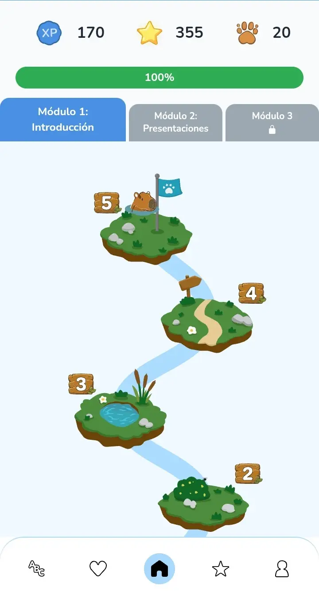
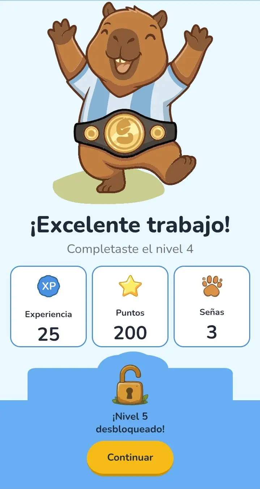
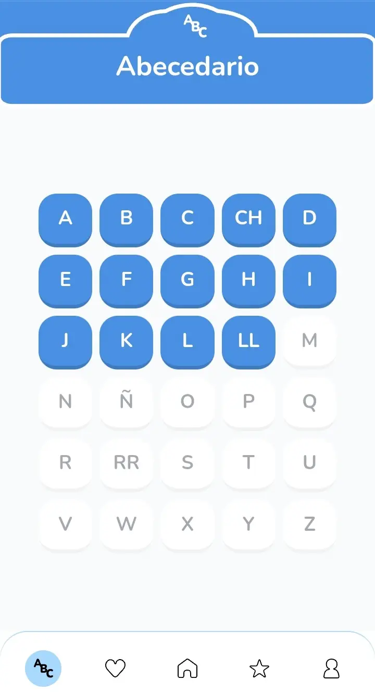
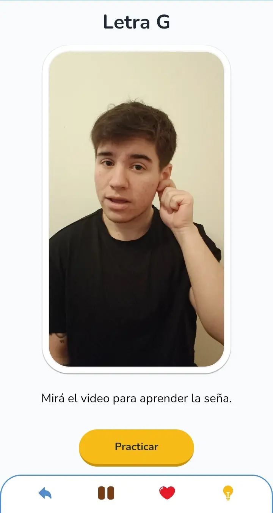
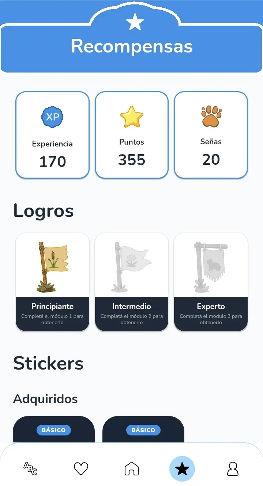
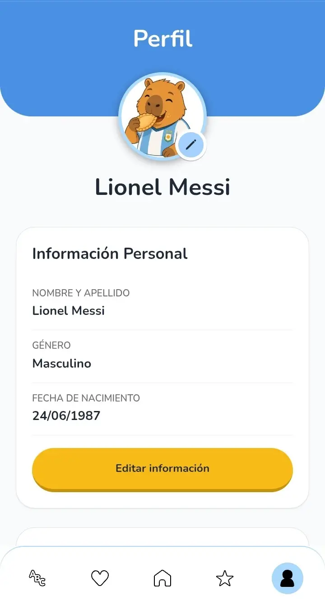

# Carpiseñas

App gamificada para aprender **Lengua de Señas Argentina (LSA)**, pensada para que las personas
aprendan de forma progresiva: un camino de islas, lecciones con video real, un abecedario
dactilológico y un sistema de recompensas (XP, puntos, señas, stickers y logros).

Proyecto grupal — repo `proyecto-lenguajeSenias-grupo9`. **Idioma del proyecto: español** (UI,
comentarios, documentación y mensajes de commit).

---

## Capturas

<p align="center">
  
  
  
  
  
  
</p>

---

## Los tres paquetes

Este repo tiene tres proyectos independientes, cada uno con su `package.json`:

| Carpeta | Qué es | Stack |
|---|---|---|
| **`frontend/`** | La app en sí (móvil + web) | Expo SDK 54 · React Native · Expo Router · NativeWind · TanStack Query · Zustand |
| **`backend/`** | API REST + migraciones de la base | Express 5 · TypeScript · Supabase (Postgres + Auth + Storage) |
| **`landing-page/`** | Sitio de presentación del proyecto | React 19 · Vite · Tailwind 4 |

`frontend/` y `backend/` se despliegan en **Vercel**; la landing, en **Netlify**.

---

## Arquitectura, en una pantalla

> Vista de conjunto. El detalle de cada paquete vive en su propio README/DOCS — ver
> [Documentación](#documentación).

```
┌─────────────┐     HTTP + Bearer JWT     ┌─────────────┐   service_role   ┌──────────────┐
│  frontend/  │ ────────────────────────► │  backend/   │ ───────────────► │   Supabase   │
│   (Expo)    │ ◄──────────────────────── │  (Express)  │ ◄─────────────── │  (Postgres)  │
└─────────────┘                           └─────────────┘                  └──────────────┘
       │                                                                          ▲
       └──────────────────  Auth (login / OAuth / refresh)  ───────────────────────┘
```

Tres cosas que conviene saber antes de tocar código:

**1. La economía la calcula y persiste el servidor, nunca el cliente.**
XP, puntos y señas salen de RPCs de Postgres (`complete_user_lesson`, `complete_alphabet_letter`,
`purchase_sticker`), que validan y escriben en una sola transacción. El cliente sólo informa qué
pasó (por ejemplo, si la lección fue perfecta) y muestra el resultado. Nunca calcula recompensas.

**2. El frontend no habla directo con la base.** Todo pasa por el backend, que usa la clave
`service_role` (bypassea RLS) pero siempre acota por el `user_id` que sale del JWT verificado —
nunca del body de la request.

**3. El contenido de los ejercicios vive en el cliente; los videos, en la base.**
`frontend/src/types/lessons.ts` define qué pasos tiene cada lección y qué se pregunta. Los videos
se referencian **por id** y se resuelven contra `GET /api/videos` — a propósito: los ids son
estables entre resubidas de Cloudinary, las URLs no.

La bisagra entre ambos mundos es **`lessons.content_key`** (`m1-l1`…`m2-l5`): la clave con la que
el front elige qué ejercicio mostrar para una lección de la base.

---

## Cómo levantarlo

### Requisitos

- **Node.js 20+** y npm
- Un proyecto de **Supabase** (para la base y la auth)
- Opcional: [Supabase CLI](https://supabase.com/docs/guides/cli) para aplicar migraciones

### 1. Backend

```bash
cd backend
npm install
cp .env.example .env    # completá las claves de tu proyecto Supabase
npm run dev             # http://localhost:3000
```

Variables (`backend/.env`):

| Variable | Para qué |
|---|---|
| `PORT` | Puerto del server (default 3000) |
| `SUPABASE_URL` | URL del proyecto |
| `SUPABASE_ANON_KEY` | Clave pública — login/registro |
| `SUPABASE_SERVICE_ROLE_KEY` | Clave privada — bypassea RLS. **Nunca exponer al cliente** |

Docs de la API en `http://localhost:3000/docs` (Swagger). Se generan desde los comentarios JSDoc de
`backend/src/routes/`, así que **sólo cubren Auth por ahora**: el resto de las rutas todavía no está
anotado. El listado completo de endpoints está en [`backend/README.md`](backend/README.md).

### 2. Frontend

```bash
cd frontend
npm install
cp .env.example .env    # ver abajo
npm start               # elegí web / Android / iOS desde el menú de Expo
```

Variables (`frontend/.env`):

| Variable | Para qué |
|---|---|
| `EXPO_PUBLIC_API_URL` | URL del backend. `http://localhost:3000` para web; la **IP LAN** de tu PC si probás en un celular físico |
| `EXPO_PUBLIC_USE_MOCK_AUTH` | `true` = datos de prueba, sin backend. `false` = contra el backend real |
| `EXPO_PUBLIC_SUPABASE_URL` / `_KEY` | Sólo para el login con Google (OAuth del lado del cliente) |

> **`EXPO_PUBLIC_USE_MOCK_AUTH=true`** deja probar la app entera sin levantar el backend: login,
> lecciones, progreso y recompensas funcionan con datos en memoria. Útil para QA y trabajo de UI.

### 3. Landing page

```bash
cd landing-page
npm install
npm run dev
```

### Migraciones

Viven en `backend/supabase/migrations/` y se aplican con la CLI:

```bash
cd backend
npx supabase link --project-ref <tu-project-ref>   # una sola vez
npx supabase migration list                        # qué falta aplicar
npx supabase db push                               # aplicar
```

⚠️ **Verificá siempre a qué proyecto estás linkeado antes de un `db push`.** El link vive en
`backend/supabase/.temp/` (gitignoreado), así que no es obvio a simple vista y no viaja entre
máquinas.

---

## Verificación

No hay tests automatizados todavía (ver [Estado](#estado-y-pendientes)). Antes de commitear:

```bash
cd frontend && npx tsc --noEmit && npm run lint
cd backend  && npx tsc --noEmit
```

**Baseline de lint del frontend: 24 warnings, 0 errores.** Compará contra eso, no contra cero — son
pre-existentes (imports sin usar y `exhaustive-deps`). Si tu cambio suma warnings, revisalo.

---

## Documentación

El detalle por paquete y por feature:

| Dónde | Qué hay |
|---|---|
| [`frontend/README.md`](frontend/README.md) | Onboarding del frontend: instalación paso a paso, rutas, estructura, convenciones y tipos de ejercicio |
| [`backend/README.md`](backend/README.md) | Onboarding del backend: puesta en marcha, listado completo de endpoints, arquitectura por capas, modelo de datos y seguridad |
| [`landing-page/README.md`](landing-page/README.md) | Landing: stack, estructura y relación con la app |
| [`frontend/CLAUDE.md`](frontend/CLAUDE.md) | Reglas de código y stack del frontend |
| [`frontend/DOCS/AUTH_IMPLEMENTATION.md`](frontend/DOCS/AUTH_IMPLEMENTATION.md) | Auth de punta a punta: sesión, refresh, guards |
| [`frontend/DOCS/LEARNING_SYSTEM_IMPLEMENTATION.md`](frontend/DOCS/LEARNING_SYSTEM_IMPLEMENTATION.md) | Sistema de lecciones y progreso: schema, RPCs, decisiones |
| [`frontend/DOCS/LESSONS_UI_IMPLEMENTATION.md`](frontend/DOCS/LESSONS_UI_IMPLEMENTATION.md) | UI de la pantalla de lección |

> ⚠️ Los archivos de `DOCS/` describen bien el **por qué** de cada decisión, pero algunos tienen
> secciones de "pendientes" desactualizadas (features que ya se implementaron después).

---

## Estado

Lo que funciona hoy de punta a punta contra la base real: auth (email + Google), el camino de
islas del home, las 10 lecciones de los Módulos 1 y 2, el abecedario completo (30 letras con
video), favoritos, y las recompensas con compra de stickers. La app además es **instalable como
PWA** desde el navegador o desde la landing.

---

## Equipo

CarpiSeñas es un proyecto grupal. Los nombres enlazan a LinkedIn.

### 🎯 Coordinación

- **[Gustavo Ovejero](https://www.linkedin.com/in/gustavo-ovejero/)**

### 📊 Data Analytics

Datasets, métricas y visualizaciones para entrenar y mejorar el modelo de reconocimiento de señas.

- **[Matías De Vivo](https://www.linkedin.com/in/matiasdevivo/)** — [GitHub](https://github.com/matiasdevivo)
- **[Inés Abarrategui](https://www.linkedin.com/in/mariainesabarrateguif/)** — [GitHub](https://github.com/minesaba)
- **[Julián Outeyral](https://www.linkedin.com/in/julian-outeyral/)** — [GitHub](https://github.com/Outeyral)

### 🎨 Diseño UX/UI

Research, wireframes y prototipos; interfaces accesibles y responsivas.

- **[Sol Diessler](https://www.linkedin.com/in/sol-diessler)** — [GitHub](https://github.com/soldiessler)
- **[Belén Coronel](https://www.linkedin.com/in/belencoronel/)** — [GitHub](https://github.com/BeluCoronel)
- **[Karina Rosa](https://www.linkedin.com/in/karinarosadev)** — [GitHub](https://github.com/karinarosadev)

### 💻 FullStack

La app móvil y web, la API y la base: los tres paquetes de este repo.

- **[Ezequiel Oliver](https://www.linkedin.com/in/ezequiel-oliver/)** — [GitHub](https://github.com/Oliver-92)
- **[Roberto Bezerra](https://www.linkedin.com/in/rbezerra18/)** — [GitHub](https://github.com/rbezerra18)

### 🧪 Testing QA

Casos de prueba funcionales y de usabilidad sobre cada entrega.

- **[Yamila Martín](https://www.linkedin.com/in/mar%C3%ADa-yamila-mart%C3%ADn-8a071b210/)** — [GitHub](https://github.com/YamiMartin)
- **[Inés Abarrategui](https://www.linkedin.com/in/mariainesabarrateguif/)** — [GitHub](https://github.com/minesaba)
